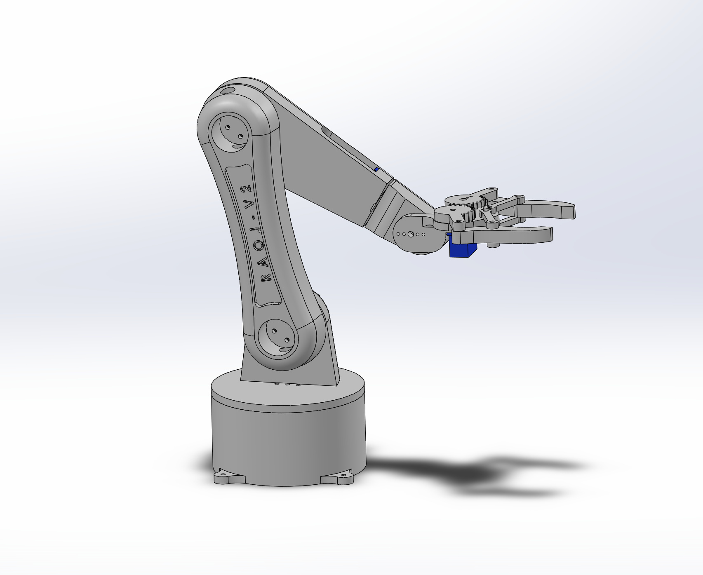
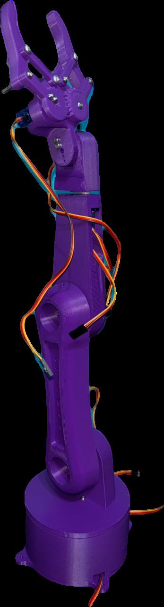
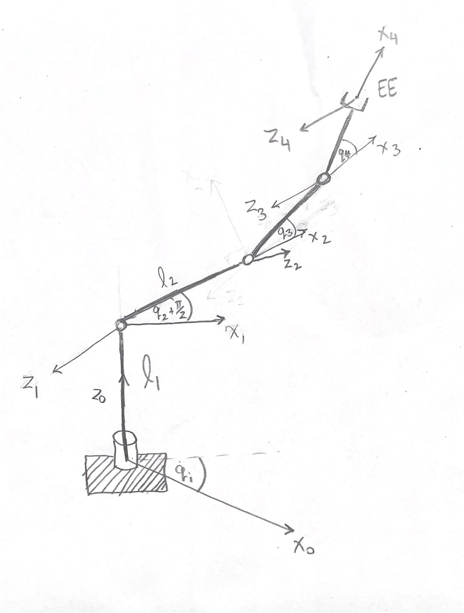
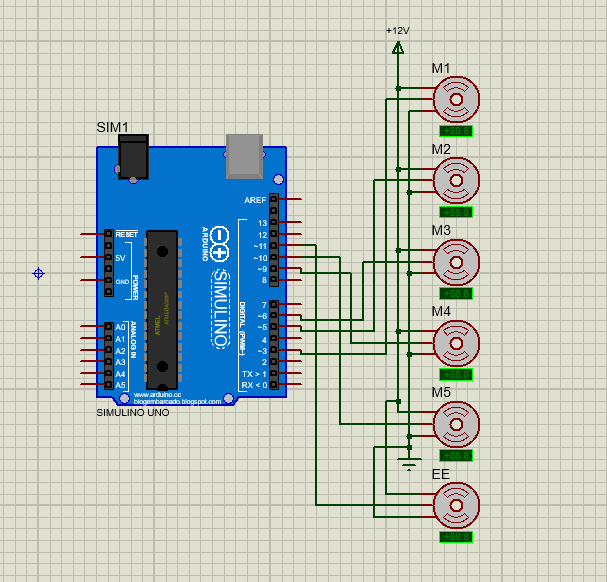
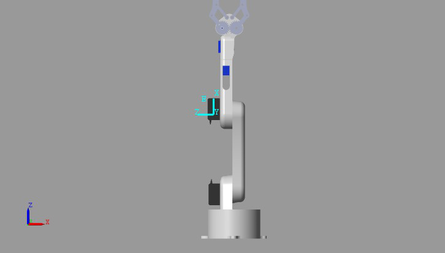
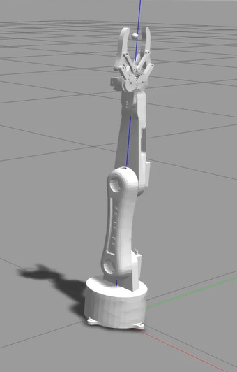
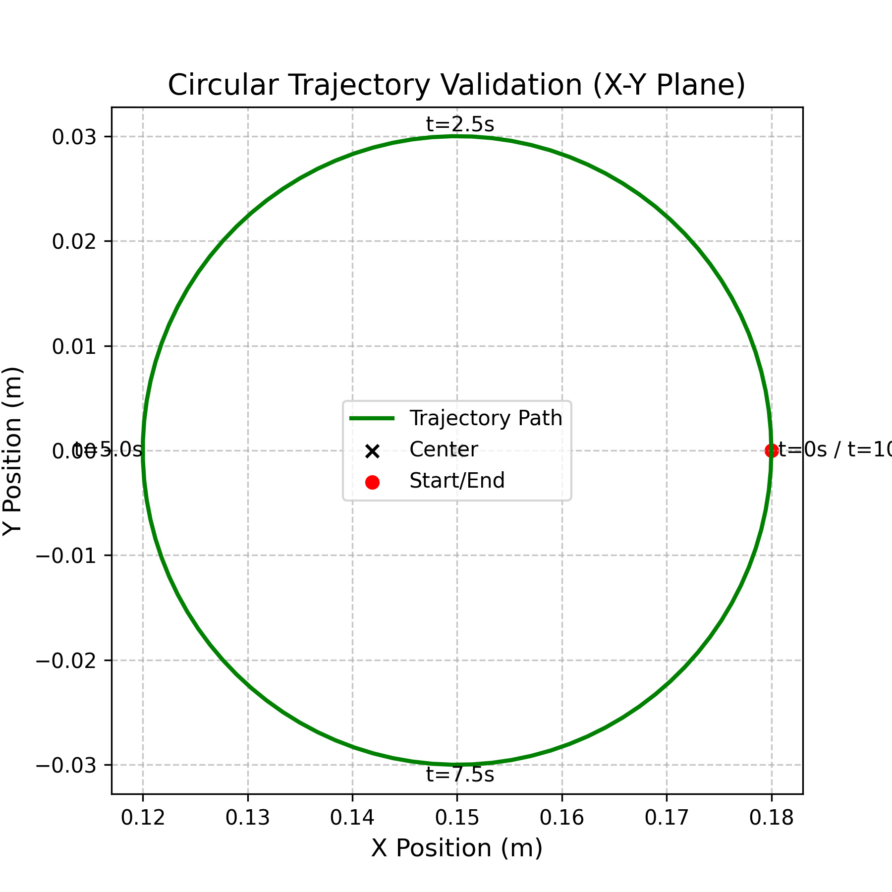
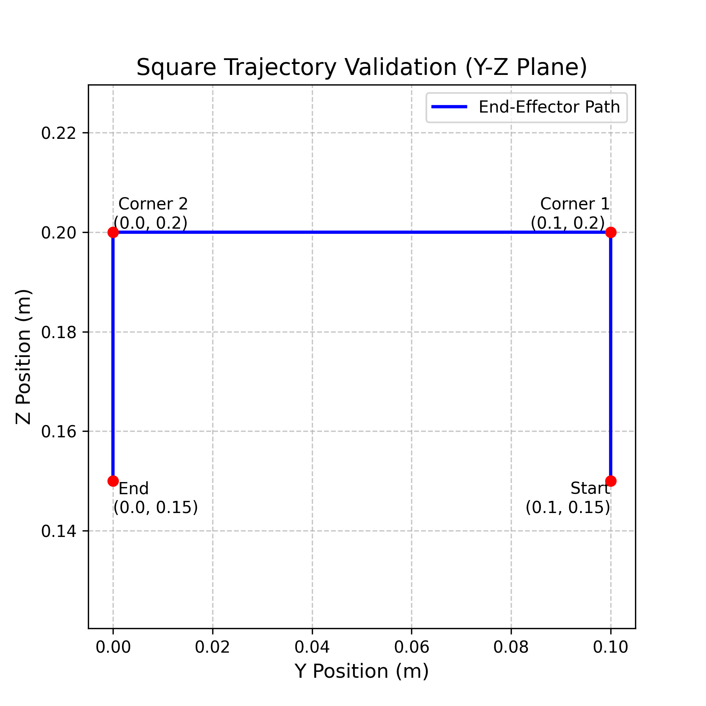
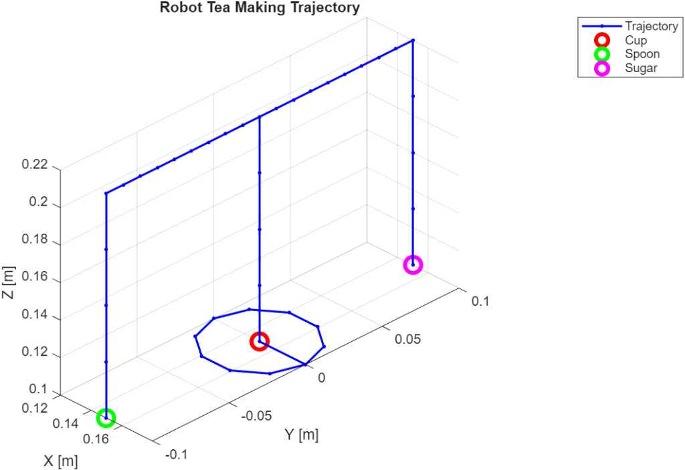

# 4-DOF Service Robotic Manipulator for Automated Beverage Preparation

[](LICENSE)
[](https://www.python.org/)
[](https://github.com/andrew-abdelmalak/4-dof-service-manipulator/actions)
[](http://wiki.ros.org/noetic)
[](https://www.mathworks.com/products/matlab.html)
[](https://www.arduino.cc/)

<p align="center">
  
</p>

A desktop-scale **4-DOF service robotic manipulator** designed for **automated beverage preparation**. The system covers the full robotics development pipeline — from DH-based kinematic modeling through dual-platform simulation (Gazebo + Simscape) to physical hardware execution on a 3D-printed arm.

The robot performs a complete **tea-preparation demo**: sugar transport, spoon manipulation, and stirring — demonstrating coordinated multi-step service tasks using open-loop trajectory control.

> **Paper:** The full IEEE-format technical report is available in [`docs/4DOF_Service_Manipulator.pdf`](docs/4DOF_Service_Manipulator.pdf).

---

## Table of Contents

- [Overview](#overview)
- [System Architecture](#system-architecture)
- [Simulation & Results](#simulation--results)
- [Tea-Preparation Demo](#tea-preparation-demo)
- [Repository Structure](#repository-structure)
- [Getting Started](#getting-started)
- [Authors](#authors)
- [License](#license)

---

## Overview

The manipulator has 5 revolute joints (4 active DOF + 1 gripper joint), constructed from **3D-printed PLA** and actuated by **MG996R** (high-torque) + **SG90** (micro) servo motors. Control is handled by an Arduino Uno communicating with a PC-based trajectory planner over serial (115 200 baud).

<p align="center">
  
</p>

### DH Parameters

Coordinate frames follow the Denavit–Hartenberg convention with the X–Z rule.

<p align="center">
  
</p>

| Link | θᵢ | dᵢ (m) | aᵢ (m) | αᵢ (rad) |
|------|-----|---------|---------|----------|
| 1 | q₁ + π/2 | 0.04355 | 0 | π/2 |
| 2 | q₂ | 0 | 0.140 | π |
| 3 | q₃ | 0 | 0.133 | π |
| 4 | q₄ | 0 | 0.109 | 0 |

### Key Results

| Metric | Value |
|--------|-------|
| FK roundtrip positional error | 0.000 m |
| IK roundtrip velocity error | ~10⁻¹⁵ (machine precision) |
| Zero-config end-effector height | 0.4255 m (= d₁ + a₂ + a₃ + a₄) |
| Trajectory sampling period | 0.1 s |
| IK damping factor (λ) | 0.05 |

---

## System Architecture

| Component | Qty | Role |
|-----------|-----|------|
| 3D-printed PLA parts | 1 set | Arm structure |
| MG996R servo motors | 3 | Base, shoulder, elbow (high-torque) |
| SG90 micro servos | 3 | Wrist, gripper, fixed pivot |
| Arduino Uno | 1 | PWM servo control |
| 12 V DC power supply | 1 | Motor power |

<p align="center">
  
</p>

**Communication protocol:** The PC-based trajectory planner sends comma-separated joint angles (`"J1,J2,J3,J4\n"`) over serial at 115 200 baud. The Arduino responds with `"READY\n"` after each command to ensure motion synchronization. Dedicated `GRIPPER_OPEN` / `GRIPPER_CLOSE` commands control the end-effector.

---

## Simulation & Results

Kinematic models and trajectories were validated on two independent simulation platforms, plus physical hardware:

<p align="center">
  
  &nbsp;&nbsp;
  
</p>
<p align="center"><em>Left: Simscape Multibody &nbsp;|&nbsp; Right: Gazebo/ROS</em></p>

**Trajectory validation** — both square (pick-and-place) and circular (stirring) trajectories were executed across all platforms with high fidelity:

<p align="center">
  
  &nbsp;&nbsp;
  
</p>
<p align="center"><em>Left: Circular trajectory &nbsp;|&nbsp; Right: Square trajectory</em></p>

| Test | Input q (rad) | ‖q_rec − q‖ | ‖q̇_rec − q̇‖ |
|------|---------------|-------------|-------------|
| Case 1 | [0, 0, 0, 0] | 0.000 | 0.000 |
| Case 2 | [0.2, 0.4, −0.3, 0.1] | 0.000 | 1.38×10⁻¹⁵ |
| Case 3 | [−0.3, 0.6, 0.2, −0.2] | 0.000 | 5.49×10⁻¹⁶ |

---

## Tea-Preparation Demo

The primary validation task demonstrates coordinated task-space motion and gripper actuation across five sequential phases:

| Phase | Motion | Points | Description |
|-------|--------|--------|-------------|
| 1 | Square path 1 | 104 | Pick up sugar cube, transport to cup, release |
| 2 | Square path 2 | 104 | Move end-effector to spoon and grasp handle |
| 3 | Reverse square | 104 | Lift spoon, transport toward cup |
| 4 | Linear transition | 42 | Center spoon inside cup |
| 5 | Circular stirring | 102 × 3 | Stir for three full cycles (30 s total) |

<p align="center">
  
</p>
<p align="center"><em>3D visualization of the complete tea-preparation trajectory showing waypoints for sugar transport, spoon approach, and stirring.</em></p>

---

## Repository Structure

```
├── simulation/
│   ├── ros/src/                        # ROS/Gazebo simulation
│   │   └── my_robot_gazebo/            # ROS package
│   │       ├── urdf/robot.urdf         # Robot description
│   │       ├── launch/                 # Gazebo launch files
│   │       ├── meshes/                 # STL mesh files
│   │       ├── config/                 # Controller configs
│   │       ├── scripts/                # Python nodes (FK, IK, trajectory)
│   │       ├── models/                 # Gazebo world models
│   │       └── worlds/                 # Gazebo world files
│   │
│   └── matlab/                         # MATLAB/Simulink
│       ├── kinematics/                 # FK, IK, Jacobian functions
│       ├── trajectory/                 # Trajectory planners + CSV data
│       ├── simscape/                   # Simulink Simscape Multibody model
│       └── tests/                      # Validation scripts
│
├── hardware/
│   ├── arduino/                        # Arduino servo control
│   │   ├── receiver/receiver.ino       # Arduino firmware
│   │   ├── send_trajectory.py          # PC → Arduino trajectory sender
│   │   └── trajectories/              # Pre-computed CSV joint angles
│   │
│   ├── cad/                            # SolidWorks CAD exports
│   │   ├── 5_DOF_Robot_Assembly.SLDASM # Full assembly
│   │   └── *.STEP                      # Individual part files
│   └── actuator_connections.pdsprj     # Proteus circuit simulation
│
├── docs/
│   ├── 4DOF_Service_Manipulator.pdf    # Full IEEE-format technical report
│   └── figures/                        # Figures from the report
│
├── .gitignore
├── LICENSE
├── README.md
└── requirements.txt
```

---

## Getting Started

### Prerequisites

| Tool | Version | Purpose |
|------|---------|---------|
| ROS Noetic | Ubuntu 20.04 | Gazebo simulation |
| MATLAB | R2023b+ | Kinematics + Simscape |
| Python | 3.8+ | ROS nodes + Arduino comm |
| Arduino IDE | 2.0+ | Firmware upload |

### Python Environment

```bash
python -m venv .venv
source .venv/bin/activate        # Linux/macOS
# .venv\Scripts\activate         # Windows
pip install -r requirements.txt
```

### ROS / Gazebo

```bash
mkdir -p ~/catkin_ws/src
ln -s /path/to/this/repo/simulation/ros/src/my_robot_gazebo ~/catkin_ws/src/
cd ~/catkin_ws && catkin_make && source devel/setup.bash

# Launch robot in Gazebo
roslaunch my_robot_gazebo spawn_gazebo.launch

# Run trajectory execution (separate terminal)
rosrun my_robot_gazebo trajectory_node.py
```

### MATLAB / Simulink

```matlab
addpath('simulation/matlab/kinematics');
addpath('simulation/matlab/trajectory');
addpath('simulation/matlab/tests');

test_forward_position     % FK validation
test_inverse_kinematics   % IK validation
test_velocity_kinematics  % Jacobian validation

% Open Simscape model
open('simulation/matlab/simscape/x5_DOF_Robot_Assembly.slx')
```

See [`simulation/matlab/README.md`](simulation/matlab/README.md) for detailed usage.

### Arduino Hardware

1. Upload `hardware/arduino/receiver/receiver.ino` to the Arduino Uno
2. Connect servos to PWM pins (Base→3, Shoulder→5, Elbow→6, Wrist→9, Gripper→10)
3. Set the serial port in `send_trajectory.py` (`/dev/cu.usbserial-110` on macOS, `COM3` on Windows)
4. Run: `python hardware/arduino/send_trajectory.py`

See [`hardware/arduino/README.md`](hardware/arduino/README.md) for detailed setup, calibration, and troubleshooting.

---

## Authors

| Name | Affiliation |
|------|-------------|
| **Andrew Abdelmalak** | Mechatronics Engineering, GUC |
| **Daniel Boules** | Mechatronics Engineering, GUC |
| **David Girgis** | Mechatronics Engineering, GUC |
| **Kirolous Kirolous** | Mechatronics Engineering, GUC |
| **Samir Yacoub** | Mechatronics Engineering, GUC |
| **Youssef Salama** | Mechatronics Engineering, GUC |

---

## Acknowledgments

This project was developed as part of the Mechatronics Engineering program at the German University in Cairo (GUC).

---

## References

1. S. Park *et al.*, "Robot versus human barista: Comparison of volatile compounds and consumers' acceptance, sensory profile, and emotional response of brewed coffee," *Food Research International*, vol. 172, p. 113119, 2023.
2. A. Setiawan and A. Ma'arif, "Stirring system design for automatic coffee maker using OMRON PLC and PID control," *Int. J. Robotics and Control Systems*, vol. 1, no. 1, pp. 1–8, 2021.
3. M. Michalková *et al.*, "Automating the handling process of a coffee machine using a robotic manipulator," in *Proc. IEEE Int. Conf. ETFA*, 2024.
4. H. P. Nurba *et al.*, "Performance evaluation of 3 DOF arm robot with forward kinematics Denavit–Hartenberg method," in *Proc. IEEE TSSA*, 2022.
5. H. D. Salman, M. N. Hamzah, and S. H. Bakhy, "Kinematics analysis and implementation of three degrees of freedom robotic arm by using MATLAB," *The Iraqi Journal for Mechanical and Material Engineering*, vol. 21, no. 2, pp. 118–129, 2021.
6. M. A. Saad *et al.*, "Development of an automated coffee preparation system using a robotic manipulator," *J. Mechatronics, Robotics, and Systems Programming*, vol. 31, no. 38, pp. 45–52, 2024.
7. A. Waluyo *et al.*, "Robot arm design for coffee maker Arduino based," in *Proc. 2nd Borobudur Int. Symposium on Science and Technology*, Atlantis Press, 2021, pp. 438–442.
8. J. J. Craig, *Introduction to Robotics: Mechanics and Control*, 3rd ed. Pearson Prentice Hall, 2005.
9. B. Siciliano *et al.*, *Robotics: Modelling, Planning and Control*. Springer, 2009.

---

## License

MIT — see [LICENSE](LICENSE).
